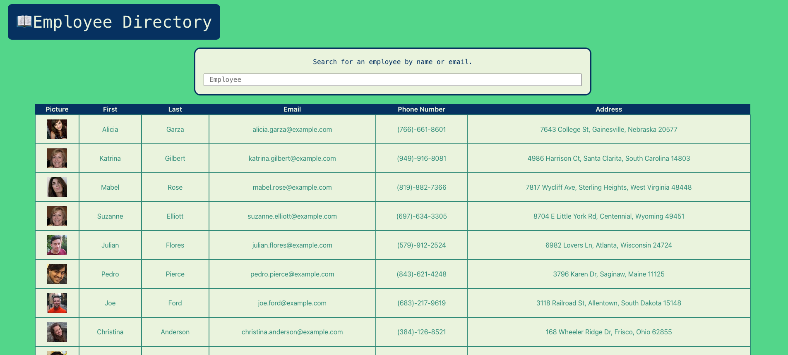
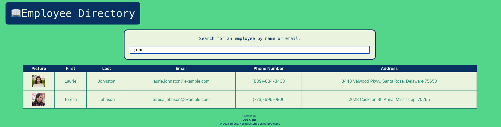

# Unit 19 React Homework: Employee Directory

## Table of Contents
* [Introduction](#introduction)
* [Functionality](#functionality)
* [Tasks Completed](#tasks-completed)
* [Technologies Used](#technologies-used)
* [Installations](#installations)
* [Demo](#demo)
* [Future Ideas](#future-ideas)
* [Sources](#sources)
* [License](#license)

 ## Introduction
A manager can look up non-sensitive employee data that can be sorted and filtered.
* Deployed App: https://jxiong15.github.io/19-employee-directory/
* GitHub: https://github.com/JXIong15/19-employee-directory

## Functionality
* When the user loads the page, they are shown a chart of employees.
* User can sort employees in descending or ascending order based on any column.
* Using the search bar, user can filter employees to match the user's search input.

## Tasks Completed
* Dowloaded necessary NPM packages with `npm install` on the Command Line
* Created `src` and necessary folders for development
* Using Axios, pulled random users as employees from the https://randomuser.me/ api.
* In the `components` directory:
  * created a `Directory.js` with a React component. 
    * Added necessary `state` variables.
    * created functions to fetch the API data, handle input change, and sort the array.
    * rendered data by passing `state props` and `functions` to other JS files
  * created a `Table.js` to display the employee data
    * all headings (`th`) except for the `picture` heading are clickable to be sorted.
    * in the `tableBody`, the passed in employee list gets mapped into individual employees. Each Employee's name, email, phone number, and address is pulled from the data.
  * created an `EmployeeDB` file to pass the `props` from the `Table.js` tableBody
    * returns data of each employee in the correct coulms to be displayed
* Added necessary scripts to the `package.json` file to deploy on GitHub Pages

Sorting "john" Example

## Technologies Used
* GitHub Pages
* React
* Props-States
* Axios

## Installations
* Axios
* React
* GH-Pages

## Demo
* App Demo:

## Future Ideas
* allow columns to sort by ascending first. An individual variable to account for each column ascending or descending.
* allow clicking on a row to take to an employee page

## Sources
* NPM Packages: https://www.npmjs.com/
* GitHub Pages: https://pages.github.com/
* Axios: https://www.axios.com/
* React: https://reactjs.org/

## License
Licensed under the [MIT License](LICENSE).

© 2021 Trilogy, Northwestern Coding Bootcamp

